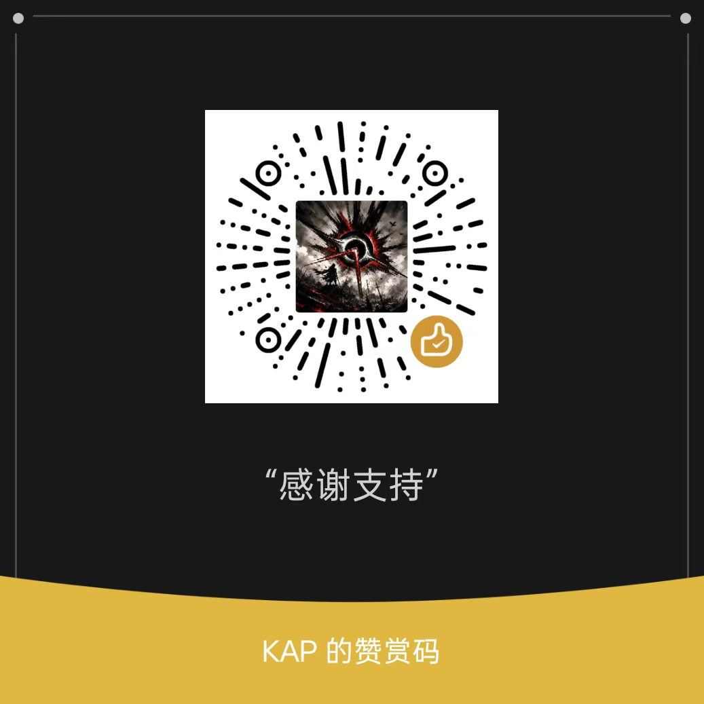

# daily_arxiv — 从你自己的文献库出发, 推荐 arXiv 上的新论文

读你电脑里的论文 PDF → 猜出你在研究什么 → 去 arXiv 找相关的新论文和经典论文 →
把**你已经有的**剔掉 → 按相关性 / 时效性 / 重要程度排序 → 用 AI 逐篇写清楚: 这篇
在做什么、跟你哪几篇工作有关、可以怎么结合。

**双击 `daily_arxiv.exe` 就能用。** 不用装 Python, 不用装任何依赖, 整个文件夹拷到
别的电脑上照样能跑。

---

## 一、跑一轮能得到什么

一份 Markdown 报告, 存在 `output/` 目录里, 文件名是
`arxiv_recommend_日期_时间.md`:

| 报告里的部分 | 内容 |
| --- | --- |
| 运行概览 | 你的库有多大、抓到多少候选、每一步花了多久 |
| 研究画像 | AI 从你的文献库里归纳出的方向、主题、方法、关键词 |
| 推荐总览 | 一张排序表, 每篇带三项分数, 以及 🆕新 / ⭐经典 / 📖已发表 标记 |
| 逐篇详解 | ① 内容讲解 ② 🔗 跟你文献的关联 (逐条对应到你库里的具体论文) ③ 💡 可以结合的研究方向 |
| 附录 | 这一轮用了哪些检索式、排除了库里哪些论文 |

界面里也能直接看: 「文献推荐」页跑完就列出结果, **点一行看详解, 双击一行打开那篇
的 arXiv 页面**。想打开报告文件本身, 点「打开报告」, 或者顶栏的「打开输出目录」。

## 二、第一次用: 三步

| 步 | 哪一页 | 做什么 |
| --- | --- | --- |
| 1 | **设置** | 填 AI 接口 (provider / base_url / API key / 模型) → 点「保存设置」。填完可以点「测试 AI 连接」当场验证 |
| 2 | **读取文献** | 点「添加文件夹…」选你放 PDF 的目录 → 选读取深度 → 点「开始读取」 |
| 3 | **文献推荐** | 勾几个 arXiv 分类 (一个都不勾 = 全站不限) → 点「开始推荐」 |

- **第 1 步可以跳过**: 不填 API key 也能跑, 只是没有 AI 讲解, 排序退化成关键词
  相似度。想要"逐篇详解"就必须填。
- 第 2 步, 219 篇 PDF 约 35 秒。**读过的不再重读**, 以后进这一页只要 0.7 秒。
- 第 3 步是唯一要等的一步 (几分钟, 看篇数)。进度条下面就是运行日志, 说清楚这一步
  具体在干什么; 等不及可以点「停止」, **已经抓到的结果照常使用**。

## 三、界面上有哪五页

| 页 | 做什么 |
| --- | --- |
| **1. 读取文献** | 增删 PDF 文件夹 (**只有这一页能改**)、选读取深度、扫描建索引 |
| **2. 文献推荐** | 抓 arXiv、打分、AI 解读; 跑完结果就列在这一页 |
| **3. 文献列表** | 看两样东西: 你读过的文献 (**双击用系统默认程序打开 PDF**), 或者**某一次的历史推荐结果** |
| **4. 设置** | AI 接口、网络代理、三个存放位置 |
| **5. 支持一下** | 赞赏码。跟功能无关, 不看也不影响任何使用 |

顶栏右上角还有三个常用入口: 「打开输出目录」(报告都在这儿)、「打开配置文件」、
「详细日志」(勾上能看到每条 PDF 的解析细节, 默认不显示)。

## 四、要做的几个选择

### 读取深度: 往下读多少正文

标题和摘要**永远都读**, 深度决定的是再往下读多少 —— 也就是送给 AI 的上下文有多
少。三档是包含关系, 往深里调只补读缺的那部分, 往浅里调一个文件都不重开。

| 档位 | 读什么 | 219 篇耗时 | 送给 AI 的字数 |
| --- | --- | --- | --- |
| **标题 + 摘要** | 首页的标题和摘要 | 最快 | 0 (只有标题摘要本身) |
| **标题 + 摘要 + 引言/结论** (默认) | 再加正文里的引言和结论 | 约 35 秒 | 约 1000 字/篇 |
| **全文** | 再加全文节选 | 最慢 | 约 2850 字/篇 |

**默认那档就够了** —— 引言和结论是"这篇在做什么、结论是什么"最密集的两段, 比全文
节选的性价比高得多。

### 限定分类: 只在某几个领域里找

勾选式, 勾几个就限定在这几个分类里 (多个分类之间是"或")。**一个都不勾 = 全站不限**,
这是默认值。

- **不勾**: 跨学科的方向 (比如用机器学习做物理问题) 更容易找到东西, 代价是候选更杂。
- **勾上**: 命中率明显提高, 代价是漏掉投在别的分类下的相关论文。

### 订阅模式: 不搜索, 只看当天的公告

勾上「订阅模式: 只抓勾选分类的当天公告, 不用检索式」之后, 程序**不再自己生成检索
式**, 候选论文全部来自所勾选分类当天的 arXiv 公告。两种方式各有所长:

| | 关键词检索 (默认) | 订阅模式 |
| --- | --- | --- |
| 候选从哪来 | 按你的文献库生成十几条检索式 | 勾选分类的当天公告 |
| 擅长 | 你已经在做的方向, 命中准 | 换个说法的新论文、你还没关注的新方向 |
| 短板 | 换了措辞就搜不到 | 候选多而杂, 全靠相关性打分筛 |
| 每次大概几篇 | 几百到上千 | 每个分类 20~50 篇 |

- **需要至少勾一个分类** —— 没有分类就没有任何来源, 没勾就点"开始"会当场提醒你。
- **只有当天有公告时才有结果**。arXiv 周末和节假日不发布公告, 那几天跑出来是空的,
  这是正常的, 不是坏了。
- 旧论文的修订版会被自动滤掉, 不然会把几年前论文的新版本当成"今天的新论文"推给你。

### 检索式: 想自己指定问题

推荐页那一栏**留空**时, 程序会用 AI 从你的文献库里归纳出十几条 (日志和报告里都会
列出来)。想自己写就往里填:

- 多条用 `;` 分开: `sign problem; deconfined quantum criticality`
- 词之间**不用**写 `AND`, 程序会自己补
- 想更准可以用字段前缀: `ti:entanglement` (标题)、`abs:sign problem` (摘要)、
  `au:Cardy` (作者); 引号包住短语: `"deconfined quantum criticality"`
- 不是越多越好: 候选池有上限, 检索式太多会让每条都抓得很少

### 推荐页那一行的其它开关

| 控件 | 作用 |
| --- | --- |
| **推荐篇数** | 这一轮要几篇 |
| **并发数** | AI 调用的并发 (默认 3)。接口限流紧就改成 1 |
| **使用 AI** | 关掉 = 纯关键词排序, 不调 AI |
| **补充引用数** | 查 OpenAlex 引用数, 用来判断"经典" |
| **跳过已推荐过的** | 打开后, 以前推荐过的论文直接不进候选 —— 想看点新的时勾 |

### 看历史推荐结果、看推荐记录

- **「文献列表」页**最上面的「列表内容」下拉框可以在"已读文献"和"某一次推荐结果"
  之间切换。选一次推荐结果, 列表换成那一轮的清单, **双击一行用浏览器打开那篇的
  arXiv 页面**。数据直接来自 `output/` 里的报告文件, 所以报告删了那一项也就没了。
- **「文献推荐」页**右下角两个按钮刻意分开: **「推荐记录」**只是把记录铺到列表里
  看 (只读, 不删任何东西), **「删除推荐记录」**才清空 (会先弹确认)。
- 记录里存着论文标题、分数、时间、作者、提交日期、期刊和当时的 AI 解读。**同一篇
  论文不会重复解读** —— 研究画像没变的话, 第二次跑连一次 AI 都不调。

## 五、文件都在哪

**全在 exe 旁边。** 整个文件夹拷到别的电脑 / U 盘上, 库和设置一起带走。

| 文件 / 目录 | 是什么 | 删了会怎样 |
| --- | --- | --- |
| `config.json` | 全部设置 (含 API key) | 下次启动重新生成一份默认的 = 重置 |
| `library_index.sqlite` | 读取记录: 每个 PDF 解析出来的元数据与正文 | 下次读取要重新解析所有 PDF |
| `recommend_history.sqlite` | 推荐记录: 推荐过哪些论文、当时的解读 | 论文不再标"已推荐过", 旧解读也不再复用 |
| `output/` | 历次报告 + 后台运行的日志 | 报告没了, 记录里的"报告路径"就指向空气 |
| `cache/` | 网络与 AI 回复的缓存 | 只是变慢 (要重新抓、重新调 AI) |
| `crash.log` | 万一崩了, 现场写在这里 | 出问题时少一条线索 |

> **别把 exe 放在 `C:\Program Files` 这类要管理员权限的目录里。** 它要往自己旁边写
> 配置、索引和报告, 放那儿会写不进去, 而且**不会报错**, 看起来就像"设置改了却不
> 生效"。放桌面、D 盘、U 盘都可以。

> **想从头来一遍**: 删掉 `config.json` (设置回到默认)。想连"读过哪些 PDF"也忘掉,
> 就再删 `library_index.sqlite` (下次要重新解析一遍, 约 35 秒)。报告和推荐记录是
> 另外两样东西, 不受影响。

> **把 exe 发给别人之前, 先删掉 `config.json`** —— 里面有你的 API key。

## 六、不开界面也能用

```bat
daily_arxiv.exe                        :: 打开界面 (双击就是这个)
daily_arxiv.exe --check                :: 不建窗口, 自检: 路径对不对、配置读到哪份、依赖缺不缺
daily_arxiv.exe --run --top 10         :: 不建窗口, 直接跑一轮
daily_arxiv.exe --run --subscribe --categories cond-mat.str-el
daily_arxiv.exe --run --tag daily      :: 报告名加个后缀, 区分多次运行
```

`--run` 后面可以跟命令行那一整套参数:

```bat
daily_arxiv.exe --run --top 30
daily_arxiv.exe --run --queries "determinant quantum Monte Carlo" "sign problem"
daily_arxiv.exe --run --categories cond-mat.str-el quant-ph
daily_arxiv.exe --run --no-ai              :: 纯关键词排序, 不调 AI
daily_arxiv.exe --run --depth fulltext     :: 这次用全文
daily_arxiv.exe --run --refresh            :: 清空网络/AI 缓存重新抓
daily_arxiv.exe --run --refresh-pdf        :: 忽略索引, 重新解析所有 PDF
```

> **`--run` 的输出不在屏幕上, 在文件里**: 窗口程序没有控制台, 所以它写进
> `<报告目录>/run_<时间戳>.log` —— 跑完先看这个文件。也正因为这样, 它可以放进
> Windows 计划任务: 每天定时 `daily_arxiv.exe --run`, 报告自己躺进 `output/`,
> 不用有人点按钮。

## 七、出问题怎么办

| 现象 | 原因 / 怎么办 |
| --- | --- |
| **双击没反应 / 窗口闪一下就没** | 在命令行里跑 `daily_arxiv.exe --check`: 它把自检报告写到 exe 旁边的 `check_report.txt` (没有控制台时也会弹窗显示), 说明路径能不能写、配置读到哪一份、依赖缺没缺。真崩了看 `crash.log` |
| **日志里全是 `HTTP 502`** | 多半是**代理挂了**: Clash / v2ray 关掉之后端口还留着监听, 每个请求都返回 502, 看起来像"arXiv 挂了"。程序会自动改走直连并写进日志。到「设置」页点「测试 arXiv 连接」能看到当前实际走哪条线路 |
| **arXiv 报 429 (Too Many Requests)** | arXiv 对共享出口 IP 限流较严。可以: 把「设置」页的**请求间隔**调到 8-10 秒、换个代理出口、或者过一会儿再跑 (抓到的有缓存, 不会重复请求) |
| **推荐跑完什么都没有** | 报告和推荐记录都是流水线**最后一步**才落盘的 —— 中途点过停止、关过窗口、或者前面某一步报错, 就不会留下。订阅模式下周末跑也是空的 |
| **文献库里的篇数比 PDF 个数少** | 正常: 同一个文件在两个文件夹里都有只算一篇; 补充材料 / 审稿意见 / 扫描件会被忽略; 同一篇的预印本和正式版也只算一篇 |
| **推荐结果不相关** | 先看报告里的"研究画像"对不对 —— 画像错了后面全错。可以自己写检索式、把读取深度调到"引言/结论"以上、或者勾上限定分类 |
| **弹窗说"有几个位置找不到了"** | 索引 / 记录 / 报告目录所在的盘符或文件夹不在了 (U 盘拔了、网盘没挂上)。到「设置」页的「记录与输出」里改成现在还在的目录 |
| **想省钱 / 想更快** | 推荐篇数调小; 读取深度别用全文; 同一批文献跑第二遍时 AI 解读会**直接复用** (研究画像没变的话一次 AI 都不调) |
| **AI 解读很慢** | 「设置」页和推荐页的**并发数**管着打分和解读这两处最慢的调用。接口限流紧就改成 1, 配额宽就调大 —— 调大只影响速度, 不影响推荐内容 |
| **日志里出现"只拿到 X/8 篇, 重试一次"** | AI 接口那一次没把话说完 (网关截断), 程序会救回完整的几条再重试一次。整体推荐不受影响, 极少数论文会退回关键词分数 |

---

> 要改代码或者自己重新打包 exe, 看 `开发笔记.md` (开发向的说明、实现细节、自检和
> 打包脚本都在那儿)。

---

## 支持一下

如果它确实帮到了你, 欢迎扫下面的码请我喝杯咖啡 —— 不打赏也完全没关系,
功能一样用, 有问题一样可以提。

**If you find this project helpful, welcome to sponsor me via WeChat.**


